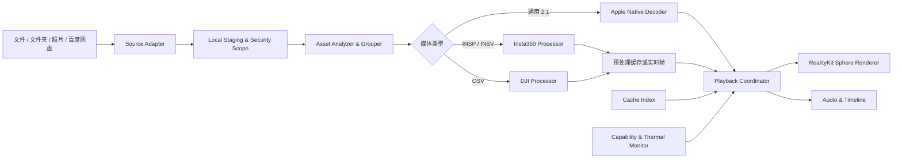

# Vuerama：Apple Vision Pro 专业全景空间播放器

> 产品需求文档（PRD）  
> 产品名称：Vuerama  
> 中文副标题：专业全景空间播放器  
> 英文副标题：Pro Immersive 360 Viewer  
> 版本：0.2  
> 日期：2026-08-17  
> 状态：需求基线，等待厂商 SDK 可行性验证  
> 首发策略：先个人使用，再准备公开上架

## 1. 产品概述

Vuerama 是一款面向 Apple Vision Pro 的专业全景照片与视频播放器。它的核心价值是让用户无需先通过 Insta360 Studio 或 DJI Studio 手工导出，即可导入全景相机原始素材，在 Vision Pro 中完成处理、管理和沉浸观看。

首批目标格式：

- Insta360：`INSP` 全景照片、`INSV` 全景视频。
- DJI：Osmo 360 生成的 2:1 全景 `JPG`、全景视频原片 `OSV`。
- 通用兼容：已完成拼接的 2:1 `JPG`、`HEIC`、`MP4`、`MOV` 和 HEVC 视频。

产品采用“本地优先、双处理管线”设计：

- 默认模式在 Vision Pro 内预处理原始素材，生成应用私有缓存后播放，以获得稳定的画质、拖动和跳转体验。
- 专业模式尝试边解码、边拼接、边渲染，提供低等待时间的实时预览。
- 当设备性能、素材规格或厂商 SDK 不支持实时模式时，自动回退至预处理模式，并明确告知原因。

## 2. 当前可行性结论

### 2.1 已确认可行

- 使用 RealityKit 和 `ImmersiveSpace` 将 2:1 等距柱状全景纹理映射到内球面。
- 用户位于球心，通过转头观看四周。
- 使用系统捏合和拖动手势旋转全景球，为头部姿态叠加 yaw/pitch 偏移。
- 从系统“文件”选择文件或文件夹，并通过安全作用域 URL 读取。
- 从系统照片选择器读取系统支持的图片和视频。
- 直接显示 DJI Osmo 360 的 2:1 JPEG 全景照片。
- 对通用 2:1 JPEG/HEIC/HEVC/MP4/MOV 文件进行本地播放。
- 通过百度网盘开放平台进行 OAuth 授权、目录浏览和文件下载；公开发布前需要完成百度平台审核和合作授权。

### 2.2 有条件可行

- `INSP`/`INSV`：Insta360 官方 Media SDK 提供图片和视频导出、拼接、防抖与多种拼接模式，但官方只明确列出 iOS、Android、Windows 和 Linux，尚未明确列出 visionOS。必须取得 SDK 后验证其 XCFramework 是否包含 visionOS 设备架构，以及是否允许公开商业分发。
- `OSV`：DJI 官方确认 Osmo 360 全景视频原片使用 OSV，但目前公开开发者资料中没有发现面向第三方的 OSV 媒体解析、拼接和防抖 SDK。需要向 DJI 获取技术接口或合作授权。
- 原始视频实时播放：取决于厂商 SDK 能否输出拼接后的逐帧像素数据，以及 Vision Pro 在目标分辨率和帧率下的持续性能。

### 2.3 不应采用的产品基础

- 不依赖修改文件扩展名来实现完整全景播放。修改 `INSV` 后缀只能在部分情况下暴露未拼接的双鱼眼视频流，不会自动完成拼接、防抖和方向校正。
- 不以逆向工程私有格式作为公开上架版本的核心方案。该路线存在兼容性、厂商授权、知识产权和 App Store 审核风险。
- 不承诺百度网盘原片无需缓存即可实时拼接。厂商 SDK 很可能要求本地文件路径，首版按下载到本地暂存区后处理设计。

## 3. 产品目标

### 3.1 核心目标

1. 用户能在 Vision Pro 内选择原始素材并直接进入处理或观看流程，无需电脑端 Studio。
2. 为兼容素材提供稳定、清晰、低眩晕的 360°球心观看体验。
3. 同时满足普通用户的易用性和专业用户对拼接、防抖、画质、方向与缓存的控制需求。
4. 本地素材默认不离开设备；云端来源只下载用户明确选择的文件。
5. 将厂商格式解析、媒体处理与空间渲染解耦，便于新增相机和格式。

### 3.2 成功标准

- 用户从选择一个已支持素材到进入观看，不需要使用其他 App 做手工导出。
- 通用 2:1 素材可以稳定播放，音画同步，手势与头部控制连续无跳变。
- 预处理任务可暂停、取消、恢复或安全失败，不损坏原始文件。
- 不支持的素材能够给出具体原因，而不是黑屏或无响应。
- 缓存占用透明、可控、可清理。
- 公开版本使用的所有厂商 SDK、云服务接口和数据权限均有明确授权依据。

## 4. 非目标范围

以下能力不属于首版：

- 视频剪辑、关键帧运镜、字幕制作和完整调色工作流。
- 将单目 360°素材转换成真实六自由度或体积视频。
- 通过身体平移看到遮挡物背后的内容。单目球面素材只支持旋转观察，不包含位置视差。
- 直播推流、多人 SharePlay、社交发布。
- 直接控制相机拍摄、相机固件升级或素材删除。
- 依赖房间网格、平面检测或主摄像头画面的混合现实功能。
- 对 DJI 无人机拍摄的一组未拼接原始照片进行自动全景拼接。

## 5. 目标用户与场景

### 5.1 目标用户

- 使用 Insta360 或 DJI Osmo 360 的个人创作者。
- 旅行、运动、活动记录和 VR 看房用户。
- 需要快速审片的全景摄影师和视频制作人员。
- 希望从本地文件或百度网盘直接浏览全景素材的 Vision Pro 用户。

### 5.2 核心场景

1. 用户将相机原片复制到 iCloud Drive 或 Vision Pro 可访问的文件夹，选择文件后直接观看。
2. 用户授权一个素材文件夹，应用自动识别、分组和建立媒体库。
3. 用户从照片库选择一张 DJI 2:1 JPEG，全沉浸查看。
4. 用户登录百度网盘，选择 INSV/OSV，下载到本地并自动开始处理。
5. 用户选择实时模式快速审片；设备无法维持实时帧率时切换到缓存模式。

## 6. 格式支持矩阵

| 格式 | 来源 | 预期处理 | 首版目标 | 当前状态 |
| --- | --- | --- | --- | --- |
| INSP | Insta360 | 官方 SDK 拼接并生成 2:1 图片缓存 | 支持 | 等待 visionOS SDK 验证 |
| INSV | Insta360 | 官方 SDK 拼接、防抖并生成 2:1 视频缓存 | 支持 | 等待 visionOS SDK 验证 |
| INSV 实时 | Insta360 | 解码、拼接、防抖、逐帧输出 | 实验性支持 | 等待逐帧接口与性能验证 |
| JPG 2:1 | DJI/通用 | 原生图片解码并直接映射球面 | 支持 | 已确认可行 |
| OSV | DJI Osmo 360 | DJI 授权解析器拼接、防抖并生成缓存 | 支持 | 厂商接口未确认，关键阻塞项 |
| OSV 实时 | DJI Osmo 360 | 解码、拼接、防抖、逐帧输出 | 实验性支持 | 厂商接口未确认，关键阻塞项 |
| MP4/MOV 2:1 | 通用 | AVFoundation/VideoToolbox 解码 | 支持 | 已确认可行 |
| HEIC 2:1 | 通用 | ImageIO/Core Image 解码 | 支持 | 已确认可行 |
| 多张无人机原片 | DJI 无人机 | 多图拼接 | 不支持 | 不在首版范围 |

不能只凭扩展名或 2:1 比例认定素材为全景。应用应结合扩展名、轨道、分辨率、媒体元数据、相机型号和用户手工指定共同判断。

## 7. 功能需求

优先级定义：

- P0：没有该能力就无法形成可用产品。
- P1：公开首版应具备。
- P2：专业增强或后续版本。

### FR-001 素材来源与导入（P0）

- 支持从系统文件选择器选择一个或多个文件。
- 支持选择文件夹并扫描其直接子目录或递归扫描。
- 文件夹授权使用安全作用域 URL；需要长期访问时保存安全作用域书签。
- 支持 iCloud Drive 和已经接入系统“文件”的第三方文件提供器。
- 支持通过 PhotosPicker 选择系统识别的图片和视频。
- INSP、INSV、OSV 等任意文件类型主要从“文件”导入，因为照片库不保证保存或暴露私有格式。
- 导入过程不得修改或覆盖原始文件。

### FR-002 百度网盘（P1）

- 使用百度官方 OAuth 页面完成帐号授权，不直接收集用户帐号和密码。
- 浏览用户授权范围内的目录、搜索文件并按支持格式筛选。
- 显示文件名、大小、修改时间、下载状态和预计本地占用。
- 用户确认后下载到应用暂存区，支持进度、取消、重试和断点续传能力评估。
- Access Token 和 Refresh Token 存入 Keychain。
- 下载链接过期时重新请求，不长期保存临时直链。
- 退出帐号时清除授权令牌；缓存文件由用户选择保留或删除。

### FR-003 媒体识别与分组（P0）

- 检测格式、分辨率、帧率、时长、编码、色彩空间、HDR、音轨和相机型号。
- 自动识别旧款 Insta360 可能产生的成对 INSV 文件。
- 自动识别长时间录像产生的分段素材，并在媒体库中按一次拍摄分组。
- 识别 OSV 与同名 LRF 代理文件之间的关系。
- 为无法解析的文件显示“格式未知”“缺少配对文件”“轨道不完整”“相机型号暂不支持”等明确状态。
- 允许用户将通用 2:1 文件手工标记为 360°素材或普通平面素材。

### FR-004 预处理管线（P0）

- 私有原片默认进入本地预处理队列。
- INSP 输出应用私有的 2:1 图片缓存。
- INSV/OSV 输出应用私有的 2:1 HEVC 视频缓存，保留可用音轨。
- 根据相机和素材元数据自动应用镜头参数、拼接、防抖和方向校正。
- 专业设置允许选择厂商 SDK 实际支持的拼接模式、防抖模式、方向锁定、保护镜/潜水壳和输出质量。
- 显示等待、准备、处理中、暂停、完成、失败和已取消状态。
- 中断后不得把未完成文件标记为可播放缓存。
- 处理完成后验证容器、视频轨道、音轨、时长和首帧可解码性，再原子化写入缓存索引。

### FR-005 实时处理管线（P1，实验性）

- 对厂商 SDK 明确支持逐帧输出的素材提供实时模式。
- 实时管线包含容器读取、硬件视频解码、镜头拼接、陀螺仪防抖、色彩处理和球面提交。
- 播放前进行设备与素材能力检测，至少检查编码硬件支持、分辨率、帧率和处理器可用模式。
- 实时播放持续掉帧、温度过高、内存压力或 SDK 报错时，暂停并建议切换预处理模式。
- 实时模式失败不影响原片和已存在缓存。
- 对暂不支持随机访问的实时管线，应明确限制精确拖动和快速跳转。

### FR-006 空间播放器（P0）

- 使用 `ImmersiveSpace` 和 RealityKit 创建内表面可见的全景球。
- 相机位于球心，保证全景球中心与用户初始观察位置一致。
- 支持全沉浸模式；后续可增加渐进沉浸和门户预览。
- 图片作为静态纹理；视频通过 AVFoundation/VideoToolbox 与 RealityKit 视频渲染能力提交。
- 正确处理球面 UV、经线接缝、上下极点和素材坐标方向。
- 提供一键回正，将当前观看方向设为新的正前方。
- 切换素材、进入沉浸空间和出现处理错误时使用短暂渐变，避免闪烁和方向突变。

### FR-007 观看控制（P0）

#### 自然观看模式

- 全景球固定于世界坐标。
- 用户通过头部旋转观察全景的不同方向。
- 不申请关闭头部追踪，也不人为锁定显示到用户头部。

#### 手势浏览模式

- 用户注视或选中球面后，使用捏合拖动改变全景球的 yaw/pitch 旋转偏移。
- 最终观察方向由系统头部姿态和用户旋转偏移共同决定。
- 松手后保持旋转位置。
- 提供回正、旋转灵敏度和惯性开关。
- 标准捏合/拖动优先使用 SwiftUI/RealityKit 系统手势，不因该功能申请详细手部骨骼权限。

### FR-008 播放控制（P0）

- 播放、暂停、进度、前后跳转、音量、静音和倍速。
- 播放控件默认在观看时淡出，通过注视和捏合重新唤出。
- 显示当前时间、总时长、处理模式、实际播放分辨率和实时掉帧提示。
- 支持结束自动退出、循环播放和播放下一项。
- 应用进入后台或沉浸空间关闭时安全暂停并保存进度。

### FR-009 专业画面设置（P1）

- 起始朝向、水平校正和方向锁定。
- 厂商 SDK 可用时提供拼接算法选择。
- 保护镜、潜水壳等镜头配置。
- SDR/HDR 输出策略与色彩空间信息展示。
- 播放质量档位：原始、高、均衡、节能。
- 实时模式允许自动降级处理分辨率或帧率，缓存模式保持用户选择的输出质量。

### FR-010 媒体库（P1）

- 按来源、日期、相机型号、格式、处理状态组织素材。
- 为原始文件、代理图和播放缓存建立关联，不复制不必要的原始文件。
- 生成缩略图时限制解码尺寸，避免直接展开 120MP 图片。
- 记录播放进度、最近观看、收藏和用户方向设置。
- 原文件不可访问时保留条目并提示重新授权或重新定位。

### FR-011 缓存管理（P0）

- 分别显示原片暂存、代理文件、已处理媒体和临时处理文件占用。
- 用户可设置缓存上限和仅在 Wi-Fi 下载。
- 空间不足时在处理开始前给出预计需求并阻止必然失败的任务。
- 支持删除单项缓存、清除临时文件和清理全部可重建缓存。
- 删除缓存不得删除文件夹、照片库或百度网盘中的原始文件。

### FR-012 错误与恢复（P0）

- 错误信息包含发生阶段、原因、是否可重试和建议动作。
- 覆盖文件授权失效、云端文件变更、配对文件缺失、编码不支持、SDK 不支持、空间不足、下载失败、处理失败、过热和内存压力。
- 可恢复错误提供重试、重新授权、重新下载或切换预处理模式。
- 不可恢复错误保留诊断信息，但默认不上传文件名、路径、照片或视频内容。

## 8. 核心用户流程

### 8.1 本地文件播放

1. 用户选择“文件”或“文件夹”。
2. 应用读取安全作用域 URL 并分析素材。
3. 通用 2:1 素材直接进入播放器。
4. INSP/INSV/OSV 进入处理方式选择：推荐预处理或实验性实时。
5. 预处理完成或实时管线准备完成后进入沉浸空间。
6. 用户选择自然观看或手势浏览。

### 8.2 百度网盘播放

1. 用户选择“连接百度网盘”。
2. 系统浏览器完成 OAuth 授权并返回应用。
3. 用户浏览或搜索文件。
4. 应用显示下载大小、缓存空间和支持状态。
5. 用户确认后下载到本地暂存区。
6. 下载完成后复用本地文件处理流程。

### 8.3 实时模式回退

1. 用户选择实时模式。
2. 应用执行编码、SDK、内存和性能能力检查。
3. 条件满足则开始实时播放并持续监控。
4. 若无法维持体验，播放器暂停并保留当前位置。
5. 用户确认后从当前位置附近开始生成缓存，完成后恢复播放。

## 9. 信息架构与界面

### 9.1 主窗口

- 来源入口：最近项目、文件、文件夹、照片、百度网盘。
- 媒体库：缩略图、格式、来源、时长、处理状态和兼容性标识。
- 处理队列：进度、预计占用、暂停、取消和错误详情。
- 设置：默认处理方式、质量、缓存、网络、隐私与授权状态。

### 9.2 播放前详情页

- 文件名、来源、格式、相机、分辨率、帧率、时长、编码、HDR。
- 配对文件或 LRF 状态。
- 推荐处理模式及推荐原因。
- 预估缓存空间。
- 专业设置折叠区。

### 9.3 沉浸播放器

- 球面全景内容。
- 可唤出的空间控制条。
- 自然观看/手势浏览切换。
- 回正按钮始终容易访问。
- 实时模式、掉帧、温度或降级状态使用低干扰提示。

## 10. 技术架构

### 10.1 模块边界

#### Source Adapter

统一描述文件、文件夹、照片库和百度网盘来源。输出可读取的本地 URL 或下载任务，不负责格式解析。

#### Asset Analyzer

读取容器和元数据，判断格式、轨道和素材关系。输出统一 `MediaAssetDescriptor`，不负责渲染。

#### Vendor Processor

分别封装 Insta360 与 DJI 能力。上层只能请求“生成 2:1 缓存”或“提供实时帧”，不依赖厂商类名，避免厂商 SDK 变更扩散到整个项目。

#### Playback Coordinator

维护播放时钟、音画同步、seek、处理模式切换、回退和恢复。

#### Sphere Renderer

只接收标准纹理或视频帧，处理球面几何、UV、空间姿态和用户旋转偏移，不解析厂商文件。

#### Cache Manager

维护原片暂存、代理图、处理中间文件、成品缓存、空间配额和安全删除。

## 11. 数据模型建议

### MediaAssetDescriptor

- 稳定资源 ID。
- 来源类型与来源定位信息。
- 文件类型、文件大小和修改时间。
- 相机厂商、型号和拍摄模式。
- 分辨率、帧率、时长、视频编码、音频编码。
- 投影类型、立体模式、HDR 和色彩空间。
- 配对文件、分段文件和代理文件列表。
- 支持状态与不支持原因。

### ProcessingJob

- 输入资产 ID、处理器类型和处理参数。
- 等待、准备、处理中、暂停、完成、失败、取消状态。
- 进度、输出 URL、临时 URL 和错误详情。
- SDK 版本、算法版本和缓存签名。

### PlaybackPreference

- 自然观看或手势浏览。
- yaw/pitch 偏移和回正参考。
- 防抖、方向锁定、质量、倍速和循环设置。
- 上次播放位置。

## 12. 权限、系统配置与外部授权

| 能力 | Apple 侧要求 | 运行时提示 | 备注 |
| --- | --- | --- | --- |
| 选择文件/文件夹 | `fileImporter`、安全作用域 URL/书签 | 系统选择器即为授权 | 没有任意扫描全盘的权限 |
| 声明 INSP/INSV/OSV | `UTImportedTypeDeclarations`、`CFBundleDocumentTypes` | 无 | 第三方格式应声明为 imported type，并符合 `public.data` |
| 选择少量照片/视频 | PhotosPicker | 不需要完整照片库权限 | 只访问用户所选项目 |
| 扫描整个照片库 | PhotoKit、`NSPhotoLibraryUsageDescription` | 需要 | 首版优先不申请，遵循最小权限 |
| 标准注视、捏合、拖动 | SwiftUI/RealityKit 手势 | 不需要详细手部权限 | 满足首版旋转交互 |
| 详细手部骨骼 | ARKit、`NSHandsTrackingUsageDescription` | 需要 | 首版不申请 |
| 平面/场景网格 | ARKit、`NSWorldSensingUsageDescription` | 需要 | 首版不申请 |
| 全沉浸球面与头部观察 | `ImmersiveSpace`、RealityKit | 不需要摄像头权限 | 不读取主摄像头画面 |
| 百度网盘 | HTTPS、OAuth 回调、Keychain | 百度帐号授权页 | 需百度开发者应用和输出能力审核 |
| 直接连接相机 Wi-Fi | `NSLocalNetworkUsageDescription` 等 | 需要 | 不在首版 |
| 相机蓝牙 | 蓝牙用途描述 | 需要 | 不在首版 |
| App Store 上架 | PrivacyInfo.xcprivacy、隐私标签、SDK 签名 | 无单独运行时提示 | 需同时核查第三方 SDK 隐私清单 |

### 12.1 厂商授权

#### Insta360

- 从官方 SDK 申请页以个人用户身份申请首轮验证。
- 在申请原因中明确写明原始 INSP/INSV 的本机播放、拼接与 Vision Pro 场景。
- 公开发布前取得允许 App Store 分发和商业使用的书面确认。
- 确认 SDK 是否支持 visionOS、App Sandbox、安全作用域 URL 和逐帧输出。

#### DJI

- 联系 DJI 开发者或 Osmo 360 商务支持，申请 OSV 媒体解析、拼接、防抖与分发授权。
- 若只能获得桌面 SDK，应将 DJI OSV 切换为伴侣端处理方案，不能宣称 Vision Pro 本机直解。
- 未取得接口或授权前，OSV 保持“目标支持、尚未通过技术门槛”的产品状态。

#### 百度网盘

- 注册百度网盘开放平台开发者和应用。
- 申请帐号关联、文件查看、下载等与产品功能匹配的最小权限。
- 个人测试使用开发环境；公开发布前完成平台资质审核与输出能力合作授权。
- 隐私政策需说明授权范围、本地缓存、令牌存储、退出帐号和缓存删除方式。

## 13. 性能与非功能需求

### 13.1 性能

- 普通 2:1 图片进入播放器前生成适配显示需求的纹理，不长期保留完整 RGBA 展开数据。
- DJI 15520×7760 JPEG 完整展开为 RGBA 约占 459 MiB，需要降采样、分块或其他内存受控策略。
- 7680×3840 视频单个 RGBA 帧约占 112.5 MiB，实时管线应优先使用硬件解码和 YUV/Metal 零拷贝路径。
- 避免 CPU 上进行多次全帧像素复制。
- 实时模式持续监控实际 FPS、丢帧、内存和温度状态。
- 预处理模式优先保证输出正确性和可恢复性，而不是追求最快完成。

### 13.2 稳定性

- 所有厂商 SDK 调用隔离在独立处理模块和受控任务中。
- App 退出、系统中断或空间关闭后可恢复处理队列。
- 缓存索引与文件写入采用临时文件加原子替换，避免半成品被识别为完成。
- 对超大文件使用流式 I/O，避免一次性读入内存。

### 13.3 隐私与安全

- 默认完全本地处理。
- 不采集媒体内容、完整本地路径或百度网盘目录结构用于分析。
- 诊断日志对文件名、帐号和路径脱敏。
- OAuth Token 只存 Keychain，不写入普通配置或日志。
- 删除帐号授权时可一并删除对应云端暂存文件。
- 公开版本提供清晰的隐私政策和缓存说明。

### 13.4 可访问性

- 所有核心操作除手势外还应提供可注视选择的按钮。
- 支持键盘、触控板等系统输入时，不把自定义手势作为唯一操作方式。
- 控件满足足够的字号、对比度和空间点击区域。

## 14. 体验与舒适度要求

- 进入全沉浸前显示明确入口和退出说明。
- 打开素材、回正、切换方向和 seek 后使用短渐变避免瞬时视觉跳跃。
- 手势旋转默认不使用过强惯性；惯性可关闭。
- 快速拖动时限制角速度，降低视觉运动和头部运动不一致造成的不适。
- 实时掉帧达到不可接受水平时停止继续播放，避免持续抖动。
- 全沉浸空间中保留易发现的退出和回正能力。
- 应用不鼓励用户在播放时走动；Vision Pro 的系统安全边界仍可能因用户移动而中断沉浸体验。

## 15. 风险登记

| 风险 | 影响 | 概率 | 缓解措施 |
| --- | --- | --- | --- |
| Insta360 SDK 不含 visionOS slice | INSP/INSV 无法本机处理 | 高 | 第一阶段立即验证；保留 Mac/iPhone 伴侣处理器 |
| Insta360 SDK 只能输出自带播放视图 | 无法与 RealityKit 球面集成实时模式 | 中高 | 验证逐帧接口；预处理成标准 2:1 缓存 |
| DJI 不开放 OSV 媒体 SDK | OSV 无法合法稳定支持 | 高 | 申请合作；将 OSV 设为独立发布门槛；准备伴侣端方案 |
| 8K 实时拼接掉帧或过热 | 实时体验不可用 | 高 | 实验性标识、能力检测、自动降级和预处理回退 |
| 超大图片/视频引发内存峰值 | 崩溃 | 高 | 降采样、分块、YUV/Metal 零拷贝、限制并发 |
| 老机型 INSV 配对/分段不完整 | 无法处理或音画错位 | 中 | 自动分组、完整性校验、明确缺失文件提示 |
| 百度下载速度、限流或直链过期 | 等待时间长或下载失败 | 中高 | 断点续传评估、重试、重新取链、本地缓存 |
| 缓存占满设备空间 | 处理失败或影响系统 | 高 | 预估空间、缓存上限、自动清理和用户确认 |
| HDR/D-Log 色彩错误 | 画面灰暗、偏色 | 中 | 读取色彩元数据、建立 SDR/HDR 测试矩阵 |
| 私有格式逆向导致法律和审核风险 | 无法公开发布 | 高 | 只采用厂商授权能力；公开版保留授权证据 |
| 第三方 SDK 隐私清单不完整 | App Store 拒审 | 中 | 上架前生成 Xcode 隐私报告并要求厂商更新 SDK |

## 16. 第一阶段技术门槛

在投入完整媒体库和视觉设计之前，必须按顺序验证以下项目：

### Gate A：原生空间播放器

- 真机打开一张 8K 或更高分辨率的 2:1 JPEG。
- 正确完成球面映射、头部观察、捏合拖动和回正。
- 播放一段标准 2:1 HEVC 视频，验证音画同步、暂停和 seek。

### Gate B：Insta360

- 获得官方 SDK 并审计 XCFramework 支持平台。
- 原生 visionOS target 成功链接、签名并在真机启动。
- 成功处理至少一张 INSP。
- 成功处理 X3、X4/X5 代表性的 INSV 样片。
- 验证成对文件、双轨文件和分段文件。
- 验证是否存在适用于 RealityKit 的逐帧输出。
- 获得个人测试和未来公开分发的授权说明。

### Gate C：DJI OSV

- 获得 DJI 对 OSV 第三方处理能力的正式答复。
- 获取普通、HDR/Log、不同分辨率和帧率的 OSV/LRF 样片。
- 确认容器、视频轨道、音频、陀螺仪和镜头参数获取方式。
- 成功生成一段标准 2:1 缓存。
- 验证是否存在实时逐帧接口。

### Gate D：百度网盘

- 完成 OAuth 登录、登出和 Token 刷新。
- 列出目录并筛选支持格式。
- 下载一个大型测试文件，验证取消、失败重试和链接过期恢复。
- 确认公开应用需要的主体资质、接口权限和合作授权。

如果 Gate B 或 Gate C 不通过，对应私有格式不得标记为“已支持”；应切换到伴侣端处理或从首发兼容列表暂时移除。

## 17. 验收标准

### 17.1 P0 功能验收

- 用户能从“文件”选择 JPG、MP4/MOV 和已通过厂商验证的私有格式。
- 用户能授权文件夹，重新启动 App 后在授权有效时继续访问。
- 2:1 JPG 能正确显示，接缝方向、上下极点和水平线无明显映射错误。
- 2:1 视频能播放、暂停、seek 并保持音画同步。
- 自然观看与手势浏览都能使用，切换时画面方向不跳变。
- 回正操作可以把当前观察方向设为正前方。
- 预处理任务显示真实状态，取消后不留下可播放的损坏缓存。
- 删除缓存不删除原始文件。
- 所有已知不支持情况都有可理解的错误说明和建议动作。

### 17.2 私有格式验收

- 每一种声明支持的相机型号至少有一组真实样片测试。
- INSV 覆盖单文件双轨、旧款配对和长视频分段场景。
- OSV 覆盖 DJI 官方支持的主要全景分辨率和至少两种帧率。
- 拼接结果方向正确，防抖和地平线处理符合用户选择。
- 实时模式失败时能够无数据损坏地回退到预处理模式。

### 17.3 权限与隐私验收

- 首版不申请摄像头、详细手部追踪、世界感知、麦克风或蓝牙等非必要权限。
- PhotosPicker 模式不申请完整照片库权限。
- 文件授权、百度授权和缓存删除路径可由用户理解和控制。
- PrivacyInfo.xcprivacy、App Store 隐私标签和第三方 SDK 隐私报告一致。

## 18. 发布阶段

### Phase 0：可行性原型

- 通用 2:1 图片/视频球面播放。
- 头部观看、手势旋转、回正。
- Insta360 SDK 架构与处理验证。
- DJI OSV 授权与解析验证。
- 不追求完整媒体库和视觉精修。

### Phase 1：个人可用版

- 文件和文件夹导入。
- 已验证格式的预处理缓存。
- 基础媒体库、处理队列、缓存管理。
- 自然观看和手势浏览。
- 实时模式实验开关。
- 本地诊断工具。

### Phase 2：联网与专业能力

- 百度网盘登录、浏览、下载和缓存。
- 专业拼接、防抖、方向和质量设置。
- 完整相机/格式兼容矩阵。
- HDR、Log 与更多音频处理验证。

### Phase 3：公开上架

- 厂商商业授权和分发许可确认。
- 百度开放平台生产审核。
- 隐私政策、隐私清单和 App Store 隐私标签。
- 第三方 SDK 签名、隐私清单和版本审计。
- 崩溃、性能、热状态、存储和无障碍测试。
- App Store 文案不得把尚未通过 Gate 的格式描述为已支持。

## 19. 产品指标

个人阶段以质量指标为主，不引入不必要的用户追踪：

- 各格式导入成功率。
- 预处理完成率和失败原因分布，仅在用户主动导出脱敏诊断时收集。
- 首帧等待时间与预处理耗时。
- 实时模式实际帧率、掉帧率和回退率。
- 播放崩溃率、内存峰值与热降级次数。
- 缓存命中率和因空间不足失败的比例。

公开阶段如加入遥测，必须默认遵守最小采集原则，并在隐私政策和 App Store 隐私标签中准确披露。

## 20. 已确定的产品决策

- 产品首先服务个人使用，架构同时为未来公开上架保留合规路径。
- 核心原始格式为 INSP、INSV、DJI 2:1 JPG 和 OSV。
- 默认允许应用内预处理并生成缓存。
- 同时提供实时渲染选项，但作为专业实验能力，必须允许自动回退。
- 两种观看交互都位于全景球心：自然转头和捏合拖动旋转。
- 第二种交互不是关闭头部追踪，而是在正常头部姿态上叠加用户旋转偏移。
- 首版本地优先，不把云上传作为处理私有格式的默认路径。
- OSV 和 INSV 是否能在 Vision Pro 本机完整支持，以厂商 SDK 与真机验证结果为准。

## 21. 官方资料

### Apple

- [在 visionOS 中添加 3D 内容](https://developer.apple.com/documentation/visionos/adding-3d-content-to-your-app)
- [创建全沉浸体验](https://developer.apple.com/documentation/visionos/creating-fully-immersive-experiences/)
- [使用 RealityKit 播放沉浸媒体](https://developer.apple.com/documentation/visionos/playing-immersive-media-with-realitykit)
- [使用 RealityKit 渲染立体视频](https://developer.apple.com/documentation/realitykit/rendering-stereoscopic-video-with-realitykit)
- [文件导入与安全作用域 URL](https://developer.apple.com/documentation/swiftui/view/fileimporter%28ispresented%3Aallowedcontenttypes%3Aoncompletion%3A%29)
- [PhotosPicker 选择授权](https://developer.apple.com/documentation/photosui/photospicker/photospicker%28ispresented%3Aselection%3Amatching%3Apreferreditemencoding%3Aphotolibrary%3A%29)
- [定义第三方文件类型](https://developer.apple.com/documentation/uniformtypeidentifiers/defining-file-and-data-types-for-your-app)
- [visionOS ARKit 权限](https://developer.apple.com/documentation/visionos/setting-up-access-to-arkit-data)
- [隐私清单](https://developer.apple.com/documentation/bundleresources/privacy-manifest-files)
- [Vision Pro 的 180°、360°与宽视场视频](https://support.apple.com/en-us/125014)

### Insta360

- [Insta360 开发者主页](https://open.insta360.com/)
- [SDK 申请](https://www.insta360.com/sdk/apply)
- [SDK 平台和组件说明](https://onlinemanual.insta360.com/developer/en-us/resource/sdk)
- [集成须知与格式说明](https://onlinemanual.insta360.com/developer/zh-cn/resource/integration)
- [X 系列 iOS SDK 概述](https://insta360develop.github.io/Insta360-Developer_Docs/ch/x/ios/guide/)
- [X 系列 iOS SDK 接口](https://insta360develop.github.io/Insta360-Developer_Docs/ch/x/ios/api/)

### DJI

- [Osmo 360 官方规格](https://www.dji.com/360/specs)
- [Osmo 360 支持页面](https://www.dji.com/support/product/360)
- [Osmo 系列素材导出指南](https://repair.dji.com/help/content?customId=01700006849&lang=zh-CN&paperDocType=ARTICLE&re=CN&spaceId=17)
- [Osmo 360 新手指南](https://repair.dji.com/help/content?customId=01700043553&lang=en&paperDocType=ARTICLE&re=US&spaceId=17)

### 百度网盘

- [百度网盘开放平台](https://yun.baidu.com/union)
- [开放能力列表](https://yun.baidu.com/union/openAbility)
- [开放平台开发者服务协议](https://yun.baidu.com/union/main/protocol/duty)

---

本 PRD 将“格式支持目标”和“已经技术验证的能力”明确分开。开发过程中只有通过对应 Gate、获得必要授权并完成真实样片测试的格式，才能进入公开兼容列表。
